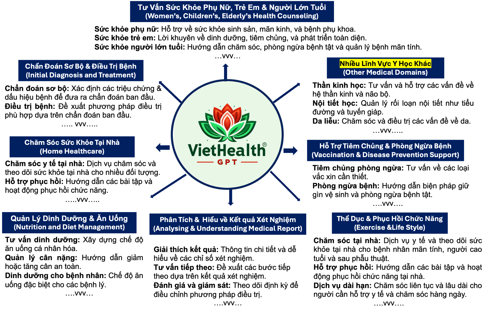
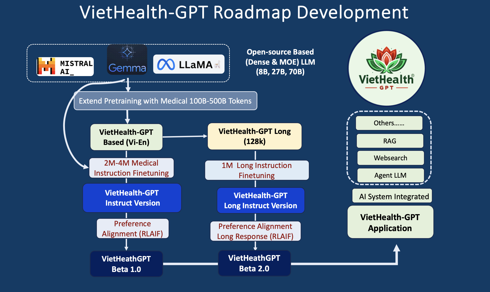

<h1 align="center">
   VietHealth-GPT - Advancing Vietnamese HealthCare Assistant
</h1>

This project aims to develop a Vietnamese Medical Foundation Assistant VietHealth-GPT.
## 💡 Get help - [Q&A](https://github.com/TranNhiem/Vietnamese_LLMs/discussions) or [Discord 💬](https://discord.gg/BC8Mqq8qYn)

<h3 align="center">
   VietHealthGPT - Initialed Target Developments
</h3>

     

## 🚨 VietHealth-GPT Demo: 🚨

+ [**VietHealthGPT Instruct Version 2024-07**](http://140.115.53.104:6667/)

**Version 2024-07** dùng khoảng **50.000 A100 GPUs** Hours (Dữ Liệu Process & Model Training Model)

**Version 2024-08-09** (Đang Training) Được Ước Tính **30.000 H100 GPUs** Hours (Dữ Liệu Process & Model Training Model)
  
## News: 
+ [2024.07] VietHealth-GPT Instruct 8B (Based LLama 3 Model-- LoRa Fineutning) 🔥
+ [2024.07] VietHealth-GPT Instruct 8B (Based LLama 3 Model-- FullParameter Fineutning) 🔥
+ [2024.07] VietHealth-GPT Instruct 70B (Yêu Cầu Try Cập Model --> Sending by Email [rick.tvn@foxconn.com])

## 1. Roadmap Development of VietHealth-GPT: 

     

## Important Medical Benchmarks on Multiple Task -- Các Bộ Dữ Liệu Đánh Giá Quan Trọng: 

+ Comprehensive and Advanced Vietnamese Benchmark for Medical Language Model
  
Bộ Đánh giá Benchmark sau bao gồm các bộ dữ liệu đánh giá chuẩn được thiết kế để đánh giá các mô hình trợ lý y tế. Dưới đây là mô tả chi tiết về từng bộ dữ liệu cùng với các chỉ số và kích thước mẫu của chúng.

| Danh Mục Đánh Giá         | Mô Tả Nhiệm Vụ Đánh Giá                                                                                    | Chỉ Số | Số Lượng Mẫu |
|--------------------------|------------------------------------------------------------------------------------------------------------|--------|--------------|
| **MedQA (USMLE)**        | 1273 câu hỏi thực tế từ kỳ thi cấp phép hành nghề y khoa Hoa Kỳ (USMLE). Các câu hỏi này kiểm tra kiến thức y khoa tổng quát, phản ánh các tình huống lâm sàng và kiến thức cơ bản cần thiết cho các bác sĩ. | ACC    | 1273          |
| **PubMedQA**             | 500 câu hỏi được xây dựng từ tiêu đề bài báo trên PubMed cùng với các bản tóm tắt làm ngữ cảnh. Bộ dữ liệu này kiểm tra sự hiểu biết và khả năng phân tích của các mô hình đối với nghiên cứu y sinh và tài liệu khoa học. | ACC    | 500           |
| **MedMCQA**              | 4183 câu hỏi từ các kỳ thi tuyển sinh y khoa ở Ấn Độ (AIIMS & NEET PG), bao gồm 2.4k chủ đề liên quan đến chăm sóc sức khỏe. Bộ dữ liệu này cung cấp cái nhìn sâu sắc về kiến thức y khoa từ bối cảnh giáo dục khác. | ACC    | 4183          |
| **MMLU-Kiến Thức Lâm Sàng** | 265 câu hỏi trắc nghiệm về kiến thức lâm sàng. Bộ dữ liệu này cung cấp các tình huống và câu hỏi liên quan đến các vấn đề y tế thực tế. | ACC    | 265           |
| **MMLU-Di Truyền Y Khoa**    | 100 câu hỏi trắc nghiệm về di truyền y học, tập trung vào các khía cạnh của di truyền học và các vấn đề liên quan đến gen. | ACC    | 100           |
| **MMLU-Giải Phẫu Học**     | 135 câu hỏi trắc nghiệm về giải phẫu học, kiểm tra kiến thức về cấu trúc cơ thể và chức năng của các hệ thống cơ thể. | ACC    | 135           |
| **MMLU-Y Học Chuyên Nghiệp** | 272 câu hỏi trắc nghiệm về y học chuyên nghiệp, tập trung vào các vấn đề liên quan đến thực hành y học chuyên sâu và kiến thức chuyên ngành. | ACC    | 272           |
| **MMLU-Sinh Học Đại Học** | 144 câu hỏi trắc nghiệm về sinh học cấp đại học, bao gồm các khái niệm sinh học cơ bản và nâng cao. | ACC    | 144           |
| **MMLU-Y Học Đại Học**     | 173 câu hỏi trắc nghiệm về y học cấp đại học, tập trung vào các kiến thức và kỹ năng cần thiết cho sinh viên y khoa. | ACC    | 173           |

## Chỉ Số Đánh Giá
Chỉ số Độ Chính Xác (ACC) được sử dụng làm chỉ số đánh giá chính trên tất cả các bộ dữ liệu. Đây là chỉ số quan trọng để đo lường mức độ chính xác và hiệu quả của các mô hình hỗ trợ y tế trong việc xử lý và

# Hiệu Suất Các Mô Hình Trên Các Bộ Dữ Liệu Đánh Giá Chuẩn Y Tế 

## Phần 1: Hiệu Suất Trên Phiên Bản Tiếng Anh
+ [**Các Model Performance**](https://huggingface.co/spaces/openlifescienceai/open_medical_llm_leaderboard)
  
| Mô Hình             | Clinical KG | Medical Genetics | Anatomy | Pro Medicine | College Biology | College Medicine | MedQA 4 opts |
|---------------------|-------------|------------------|---------|--------------|-----------------|------------------|--------------|
| VietHealth-GPT-70B (2024-07)      | 91.13       | 91.32           | 82.904  | 92.63        | 90.827          | 84.69           | 77.33       |
| VietHealth-GPT 8B   (2024-07)   | -      | -          | -  | -       | -         | -           | -      |
| LLAMA3.1-70B      | -      | -          | -  | -       | -         | -           | -      |
| LLAMA3.1-8B      | -      | -          | -  | -       | -         | -           | -      |
| LLAMA3-70B      | -      | -          | -  | -       | -         | -           | -      |
| LLAMA3-8B      | -      | -          | -  | -       | -         | -           | -      |
| OpenBioLLM-70B      | 92.93       | 93.197           | 83.904  | 93.75        | 93.827          | 85.749           | 78.162       |
| Med-PaLM-2 (5-shot) | 88.3        | 90               | 77.8    | 95.2         | 94.4            | 80.9             | 79.7         |
| GPT-4               | 86.04       | 91               | 80      | 93.01        | 95.14           | 76.88            | 78.87        |
| Med-PaLM-1 (Flan-PaLM, 5-shot) | 80.4 | 75          | 63.7    | 83.8         | 88.9            | 76.3             | 67.6         |
| OpenBioLLM-8B       | 76.101      | 86.1             | 69.829  | 78.21        | 84.213          | 68.042           | 58.993       |
| Gemini-1.0          | 76.7        | 75.8             | 66.7    | 77.7         | 88              | 69.2             | 58           |
| GPT-3.5 Turbo 1106  | 74.71       | 74               | 72.79   | 72.79        | 72.91           | 64.73            | 57.71        |
| Meditron-70B        | 66.79       | 69               | 53.33   | 71.69        | 76.38           | 63               | 57.1         |
| gemma2-9b            | -      | -          | -  | -       | -         | -           | -      |
| gemma2-27b            | -      | -          | -  | -       | -         | -           | -      |
| gemma-7b            | 69.81       | 70               | 59.26   | 66.18        | 79.86           | 60.12            | 47.21        |

## Phần 2: Hiệu Suất Trên Phiên Bản Tiếng Việt (Comming Soon)
| Mô Hình             | Clinical KG (Vi) | Medical Genetics (Vi) | Anatomy (Vi) | Pro Medicine (Vi) | College Biology (Vi) | College Medicine (Vi) | MedQA 4 opts (Vi) |
|---------------------|-------------|------------------|---------|--------------|-----------------|------------------|--------------|
| VietHealth-GPT 70B   (2024-07)   | -      | -          | -  | -       | -         | -           | -      |
| VietHealth-GPT 8B   (2024-07)   | -      | -          | -  | -       | -         | -           | -      |
| LLAMA3.1-70B      | -      | -          | -  | -       | -         | -           | -      |
| LLAMA3.1-8B      | -      | -          | -  | -       | -         | -           | -      |
| LLAMA3-70B      | -      | -          | -  | -       | -         | -           | -      |
| LLAMA3-8B      | -      | -          | -  | -       | -         | -           | -      |
| OpenBioLLM-70B       |-          | -               | -     | -           | -              | -              | -           |
| Med-PaLM-2 (5-shot)  |-          | -               | -     | -           | -              | -              | -           |
| GPT-4O               |-          | -               | -     | -           | -              | -              | -           |
| Med-PaLM-1 (Flan-PaLM, 5-shot)  |-          | -               | -     | -           | -              | -              | -           |
| OpenBioLLM-8B       |-          | -               | -     | -           | -              | -              | -           |
| Gemini-1.0          |-          | -               | -     | -           | -              | -              | -           |
| GPT-3.5 Turbo 1106  |-          | -               | -     | -           | -              | -              | -           |
| Meditron-70B       |-          | -               | -     | -           | -              | -              | -           |
| gemma2-9b            | -      | -          | -  | -       | -         | -           | -      |
| gemma2-27b            | -      | -          | -  | -       | -         | -           | -      |
| gemma-7B            |-          | -               | -     | -           | -              | -              | -           |

## Hợp Tác & Tài Trợ Cho Dự Án:
  - Bạn có thể kết nối trực tiếp với Trần Nhiệm [rick.tvn@foxconn.com](). Hoặc có thể chat trực tiếp ở: [LinkedIn](https://www.linkedin.com/in/tran-nhiem-ab1851125/) [Facebook](https://www.facebook.com/jean.tran.336). [X](https://twitter.com/TranRick2). [Zalo +886 934 311 751]()

